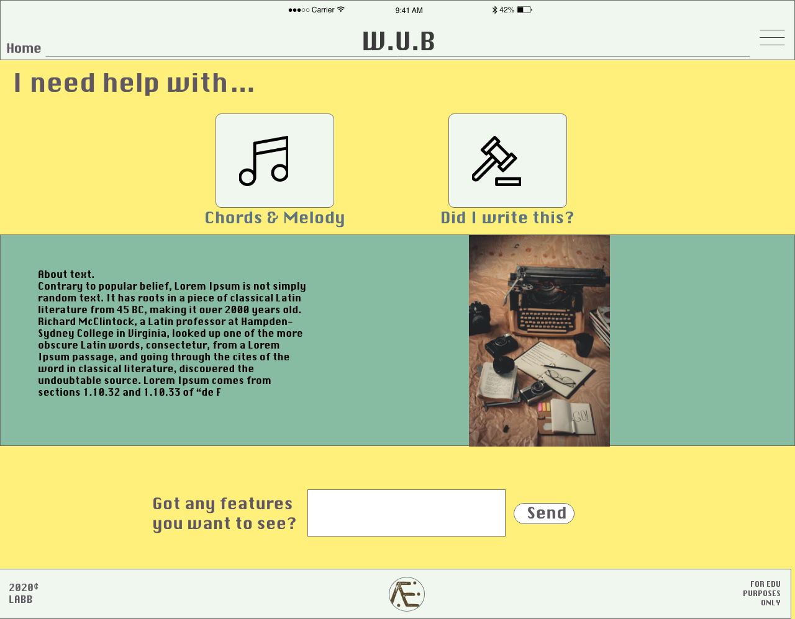
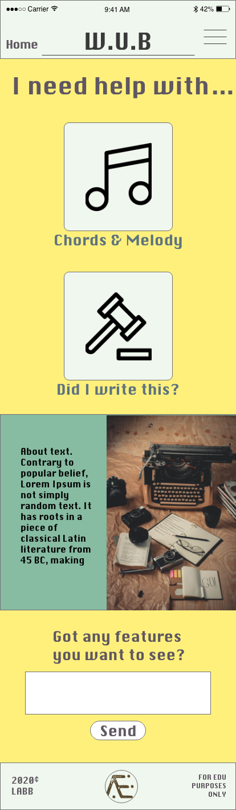
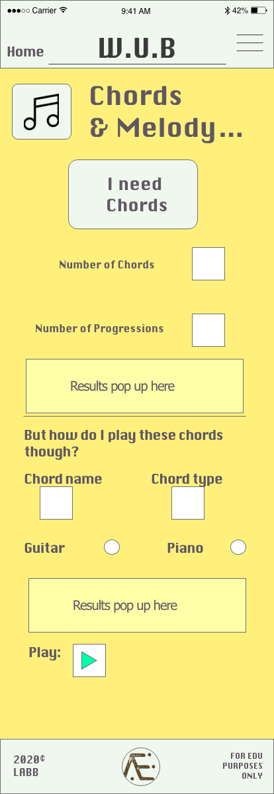
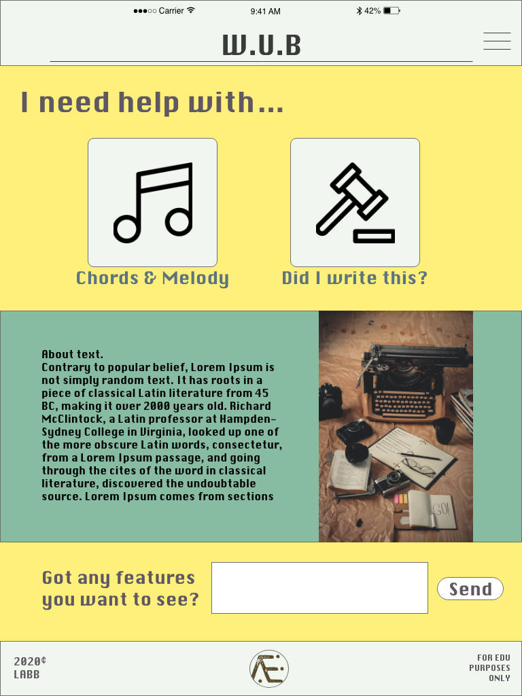
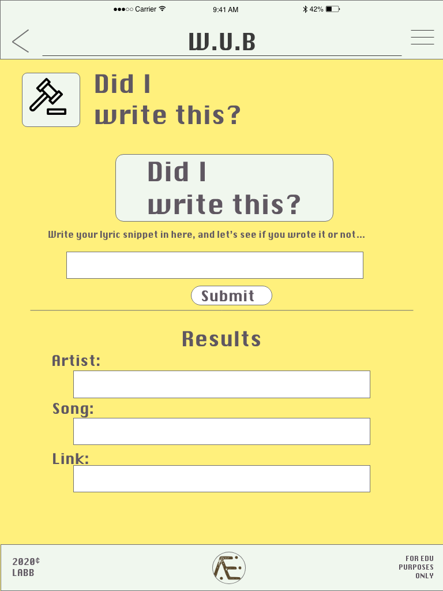

- [W. U. B (Writers UnBlocker)](#w-u-b--writers-unblocker-)

Thank you for checking out this site. W. U. B is a one stop shop for creatives to get a quick rev on their accelerator pedal. If you have any questions, comments or bugs, please let me know and get in touch :).

1. [UX](#ux)

- [Project Goals](#project-goals)
- [Target Audience Goals](#target-audience-goals)
- [Target audience](#target-audience)
- [User Goals](#user-goals)
- [User Stories](#user-stories)

* [Mr. Bloggs](#mr-bloggs)
* [Ms. C. Thweepioh](#ms-c-thweepioh)
* [They Maplecourt](#they-maplecourt)
  - [Site Owner Goals](#site-owner-goals)

- [User Requirements and Expectations](#user-requirements-and-expectations)
  - [User Requirements](#user-requirements)
  - [User Expectations](#user-expectations)
- [Design Choices](#design-choices)
  - [Fonts](#fonts)
  - [Icons](#icons)
  - [Colours](#colours)
- [Features](#features)
- [Features That Will Be Implemented In The Future](#features-that-will-be-implemented-in-the-future)
- [Technologies Used](#technologies-used)
  - [Languages](#languages)
  - [Tools & Libraries](#tools---libraries)
- [Testing](#testing)
  _ [Test Planning](#test-planning)
  _ [Testing Stories](#testing-stories)
  - [Overall](#overall)
- [Bugs](#bugs)
  - [EmailJs JS impliment Bug](#emailjs-js-impliment-bug)
  - [Rapid API SDK issue](#rapid-api-sdk-issue)
- [Deployment](#deployment)
  - [Running W.U.B Locally](#running-wub-locally)
- [Credits](#credits)
  - [Media](#media)
  - [Acknowledgements](#acknowledgements)

## UX

### Project Goals

Writers Unblock is designed to give an artist a little push through barriers that they commonly face. The goal is to provide a **non-nonsense**, almost **instant injection of creativity**, or reassurance. It is designed to be **easily usable** and readable.

### Target Audience Goals

#### Target audience

- Music writers
- Music composers

#### User Goals

- A website that can be **operated by a guitarist** with a guitar in **one hand**, and a plectrum coiled in the other, with only **one finger available** for tapping.

- Simple and complicated chord sequence generators.
- Direct contact for feature requests.
- No frills, easy to navigate design.
- Easily recognisable on all browser sizes.

#### User Stories

##### Mr. Bloggs

_As a composer and pianist I expect a site that can **generate harmony**, in key, instantly, and flexibly._

##### Ms. C. Thweepioh

_As a musician and web developer, I want the ability to **get in touch** with the developer and suggest feaures, potentially to collaborate and let them know of nay bugs or improvements._

##### They Maplecourt

_As a lyricist, I make lyrics all day, every day of the week. Sometimes I need to **make sure that what I make is mine**, without sifting through unrelated search results._

#### Site Owner Goals

- Provide **results easily** and effortlessly to writers.
- Maintain a level of **theoretical stability** in the generation of musical chords and melody.
- Not to collect, or try to claim, any ownership, credit, contact details or watermarking of content provided to any final product that emerges from the results generated on the site.

## User Requirements and Expectations

### User Requirements

- **Easy buttons** to sections.
- Familiar navbar as to not get lost or confused about where they are.
- Instant and varied results from each generation
- Only song lyrics to be searched and returned in lyric search.

### User Expectations

- Varied enough results every time, so if initial generation result is not satisfactory, the next one should not appear familiar to its predecessor.
- Text bars are copy and paste friendly
- Site should be **accessable on all browsers** from mobile to desktop.
- Any feature suggestions to go **direct to developer**.

## Design Choices

This is purely functional web application, design is feature focused, and style comes second. I went for a relatively light background to keep the focus on the darker content. Large active buttons used for generations of content.

### Fonts

The font used in the wireframes is called [Krungthep](http://fonts3.com/fonts/k/Krungthep.html) which looks as mechanical as possible without appearing too comical or ironic. Which goes with the purely functional theme I'm applying site-wide. The focus is to provide short, highly literal, informative information to the user so as to **not distract** from what's important - the content generation.

Implimentation of this font proved too difficult for loading so a new and similar font was chosen on the same merits from **Google Fonts** called [**Press Start 2P**](https://fonts.google.com/specimen/Press+Start+2P?category=Display,Monospace&preview.size=64&preview.layout=row&selection.family=Press+Start+2P|Roboto+Slab&sidebar.open#pairings") and **Roboto** for minor text.

### Icons

Icons, much in the same way as the font, were designed to be as transpoarent as possible. I got the fonts, initially from [FlatIcon](https://www.flaticon.com/home) and then later from [Font Awesome](https://fontawesome.com/) both for free.

### Colours

Colour palette was generated at [Coolors.co](https://www.coolors.co). I auto generated a palette, freezing certain tones that felt right until a strong contrasting palette was finished. Something striking and not too distracting.

- Primary Green - #87BBA2 - This muted green is used for buttons that activate or do things. All the generate buttons have this colour.
- Background Yellow - #FFF07C - This muted yellow is used to keep the focus on the generation buttons. The theory behind it that green is go and yellow is slow-down. I found that the focus is drawn to the green off the yellow much easier than any other colour I tried.
- Teriary Pearl/Cream - #F0F70E - I used this off white in the headers and the footers to prive a clear background for navigatiopnal information without distraction.
- Grey and black - #000000 & #5D737E - These darker colours are used for text, icons and and results.

The palette:


## Wireframes

### Original Concept


### Desktop



### Mobile





### Tablet





## Features

- 2 easy to navigate features on home page.
- One page for all content, Javascript hides other content when certain features are selected.
- Music harmony random generator.
- how-to diagrams and sound-like audio clips of any chord imaginable.
- Direct contact with developer.
- Lyric search.

## Features That Will Be Implemented In The Future

- Features for writers, novelists, or games masters with a pen in one hand and their phone / tablet in the other - to generate names of a wide array of things from names, pets and places, to orcs, dragons and angels.

- Simple and complicated, in key, melody generator.

- Auto fill from chord generator to chord play, and then pass that key into melody generator so only one button is needed to generate all that content.

## Technologies Used

### Languages

- [HTML](https://developer.mozilla.org/en-US/docs/Web/HTML)
- [CSS](https://developer.mozilla.org/en-US/docs/Glossary/CSS)
- [JavaScript](https://developer.mozilla.org/en-US/docs/Glossary/JavaScript) is used to generate chords, hide DOM elements and call APIs on this project.
- [JQuery](https://jquery.com) is used to simplify DOM manipulation.

### Libraries & Frameworks

- [Bootstrap](https://getbootstrap.com/)
- [Git](https://git-scm.com/)
- [Google Fonts](https://fonts.google.com/)
- [Font Awesome](https://fontawesome.com/)
- [EmailJS API](https://www.emailjs.com/)
- [Google Cloud Platform](https://cloud.google.com/) - for captcha on EmailJs.
- [Shazam API](https://rapidapi.com/apidojo/api/shazam) - provided lyric search results via it's api.
- [Scales-Chords API](https://www.scales-chords.com/api/) - for chord charts and sound clips.
- [Scraggo Music Tools](http://www.scraggo.com/) - javascript chord generation.
- [Loading IO](https://loading.io/) - animated gif loading image. 

### Tools

- [Adobe XD](https://www.adobe.com/uk/products/xd.html) was used to create interactive wireframes, giving the ability to live-test on all platforms
- [VS Code](https://code.visualstudio.com/)

## Testing

<!--
**ask Simen**

##### Test Planning

##### Testing Stories

### Overall
- Responsiveness -
- Plan -
- Implimentation -
- Result -
- Verdict -
- Design -
- Plan -
- Implimentation -
- Results -
- Verdict -

<!-- //  1. Contact form:
        1. Go to the "Contact Us" page
        2. Try to submit the empty form and verify that an error message about the required fields appears
        3. Try to submit the form with an invalid email address and verify that a relevant error message appears
        4. Try to submit the form with all inputs valid and verify that a success message appears.

    In addition, you should mention in this section how your project looks and works on different browsers and screen sizes.

    You should also mention in this section any interesting bugs or problems you discovered during your testing, even if you haven't addressed them yet.

    If this section grows too long, you may want to split it off into a separate file and        link to it from here. -->

## Bugs

Throughout development of the site I had a live deployment and a local preview of the project in chrome with dev. inspector open on each tab. So most bugs were squashed during the build. However there were some issues worth mentioning.

### EmailJs JS impliment Bug

- **Bug** EmailJs send would trigger on each page refresh, twice, without content.
- **Fix** Moving the JS function code within it's own '{}' curly brackets as a function fixed the problem.
- **Verdict** Changing the scope of the variables used in the JS code for EmailJs fixed the problem, thank you to fellow pupil Chris Palmer for helping me with that.

### Rapid API SDK issue

- **Bug** Lyric search feature was firing but not returning the correct data from the API.
- **Fix** Code Institute tutors located and found the probelm was with the Rapid API SDK sample code, providing incorrect headers and JSON code.
- **Verdict** I wouldn't have known it at the time, but experience will have helped to spot this myself.

### Chord chart call

- **Bug** When trying to impliment the Scales-Chords-Api to insert 'how to play' chord images, I found that their documentation was aimed at static sites. Their call to their api was in the form of a custom tag "<ins>" which only called on a page load, when the HTML was read. 
- **Fix** I connected with another programmer called Bim Williams, who, as a musician, was interested in this idea anyway. He dove deeper than I was able to, into their api call and helped to show me how to break down the code that is called, so i could call it when I needed. 
- **Verdict** Once again, experience was the key here. Very glad I was showed how to do this!

## Deployment

**W.U.B** was developed on **VS Code**, using **git** and **GitHub** to host the repository.

When deploying **W.U.B** using **GitHub Pages** the following steps were made:

- Opened up **GitHub** in the browser.
- Signed in using username and password.
- Selected my **repositories**.
- Navigated to **'/lornebb/LORNEBB_MS2'**.
- In the top navigation clicked **'settings'**.
- Scrolled down to the **GitHub Pages** area.
- Selected **'Master Branch'** from the **'Source'** dropdown menu.
- Clicked to confirm my selection.
- W.U.B now live on GitHub Pages.

### Running W.U.B Locally

Cloning **W.U.B** from **GitHub**:

- Navigate to **'/lornebb/LORNEBB_MS2'**.
- Click the green **'Clone or Download'** button in the top right.
- Copy the **url** in the dropdown box.
- Using your favourite **IDE** open up your preferred **terminal**.
- Navigate to your desired file location.
- Copy the following **code** and input it into your terminal to clone Holiday Destinations.

```bash
git clone https://github.com/lornebb/LORNEBB_MS2.git
```

## Credits

- **Chris Palmer** - helped with JavaScript and API integration troubleshooting.
- **David Williams** - helped navigate some API documentation suggestions.
- **CI Student care** - helped with incomplete SDK from API.
- [Bootstrap snippets](https://bootsnipp.com/snippets/GqBjl) **dvinciguerra** for the Square Buttons.
- **Bim Williams** - Cracked the Scales-Chords-Api call problem by deep diving into their api!

### Media

- The photos used in this site were obtained from **FREEPIK** via FlatIcon.com for icons in wireframes, and the photo is by **Wallace Chuck** from **Pexels**.

### Acknowledgements

- I received inspiration for this project from my brother, who just happened to ask the right question at the right time, as always.
